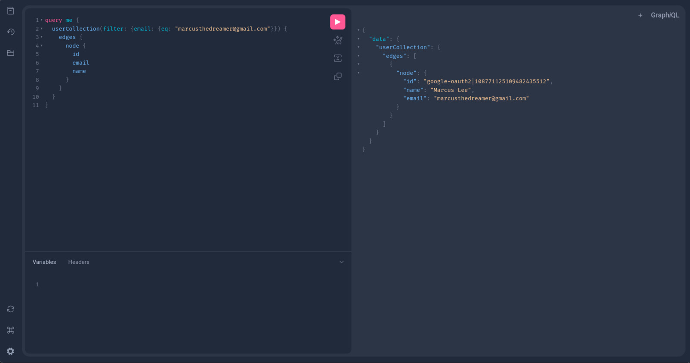

# API

*API Server for FGACYC's Database*

This project aims to build an API layer to interact with FGACYC's underlying PostgreSQL database. It initially started 
off as a REST API implemented in Rust but later due to maintainability issues, we switched over to a more autonomous 
solution with the [pg_graphql](https://github.com/supabase/pg_graphql) extension. 

What this enabled us to do is that we do not need to manually write API endpoints for each table we add onto the database, 
it would automatically instropect our SQL database and generate relevant GraphQL schema for it on-the-fly.

At the moment, you can find the hosted GraphQL API at:

- [GraphIQL Playground](https://graphql-playground.fgacyc.com)
- [GraphIQL Playground (Dev)](https://graphql-playground.development.fgacyc.com)

Note that to access the GraphQL API, an `Authorization: Bearer <access_token>` header is needed, the `access_token` here 
can be generated after an **Auth0** login. The playground already has **Auth0** integrated and after you logged in, it 
will just work directly.



The figure above shows an example query to get the user's information from the database. You can discover more *collections* 
in the playground and note that pagination is natively implemented if required.

To access the GraphQL API directly, following is the endpoints where you can use with client libraries in JavaScript / Dart:

- [GraphQL API](https://graphql.fgacyc.com/rpc/graphql)
- [GraphQL API (Dev)](https://graphql.development.fgacyc.com/rpc/graphql)

Do not hesitate to reach out or open an issue in this repo if you encounter blockers implementing the GraphQL API in your 
application.

---

## Setup the `pg_graphql` server

### 1. Install `pg_graphql` onto the postgres instance

```sql
create extension pg_graphql;

create function public.graphql(
    "operationName" text default null,
    query text default null,
    variables jsonb default null
)
    returns jsonb
    language sql
as $$
    select graphql.resolve(query, variables);
$$;

create role anon noinherit;
create role authenticator noinherit;
grant anon to authenticator;
```

### 2. Hosting the server

Make sure you have the correct `.env`, then run `docker compose up -d`. Refer to `.env.example` for the env you need to have.

Also, remember to update the url in `docker/index.html` in case the url changes

##
